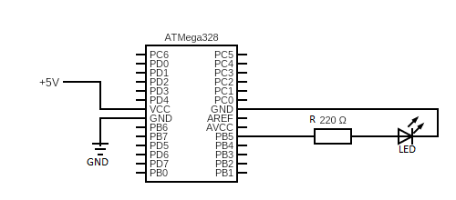

# Lab 1: Tomáš Marčák

Link to my `Digital-electronics-2` GitHub repository:

[My DE2 Repository](https://github.com/tmarcak/Digital-electronics-2)


### Blink example

1. What is the meaning of the following binary operators in C?
   * `|` OR
   * `&` AND
   * `^` XOR
   * `~` NOT
   * `<<` Shift to the left
   * `>>` Shift to the right

2. Complete truth table with operators: `|`, `&`, `^`, `~`

| **b** | **a** |**b or a** | **b and a** | **b xor a** | **not b** |
| :-: | :-: | :-: | :-: | :-: | :-: |
| 0 | 0 | 0 | 0 | 0 | 1 |
| 0 | 1 | 1 | 0 | 1 | 1 |
| 1 | 0 | 1 | 0 | 1 | 0 |
| 1 | 1 | 1 | 1 | 0 | 0 |


### Morse code

1. Listing of C code with syntax highlighting which repeats one "dot" and one "comma" (BTW, in Morse code it is letter `A`) on a LED:

```c
#define LED_GREEN	PB5 	// AVR pin where green LED is connected
#define SHORT_DELAY 	300 	// Delay in milliseconds - 1 unit 
#define LONG_DELAY	900 	// Delay in milliseconds - 3 units
#define END		2100 	// Delay in milliseconds - 7 units
#define DOT		300 	// Duration of a dot - 1 unit
#define DASH		900 	// Duration of a dash - 3 units

int main(void)
{
    // Set pin as output in Data Direction Register
    // DDRB = DDRB or 0010 0000
    DDRB = DDRB | (1<<LED_GREEN);

    // Set pin LOW in Data Register (LED off)
    // PORTB = PORTB and 1101 1111
    PORTB = PORTB & ~(1<<LED_GREEN);

    // Infinite loop
    while (1)
    {
        // Invert LED in Data Register
        // PORTB = PORTB and 0010 0000
        PORTB = PORTB & ~(1<<LED_GREEN);
		
		// Letter D
		PORTB = PORTB ^ (1<<LED_GREEN);		// Led on
		_delay_ms(DASH);			// 3 units 
		PORTB = PORTB & ~(1<<LED_GREEN);	// Led off
		_delay_ms(SHORT_DELAY);			// 1 unit
		PORTB = PORTB ^ (1<<LED_GREEN);		// Led on
		_delay_ms(DOT);				// 1 unit
		PORTB = PORTB & ~(1<<LED_GREEN);	// Led off
		_delay_ms(SHORT_DELAY);			// 1 unit
		PORTB = PORTB ^ (1<<LED_GREEN);		// Led on
		_delay_ms(DOT);				// 1 unit
		
		// Gap between the letters
		PORTB = PORTB & ~(1<<LED_GREEN);	// Led off
		_delay_ms(LONG_DELAY);			// 1 unit
		
		// Letter E
		PORTB = PORTB ^ (1<<LED_GREEN);		// Led on
		_delay_ms(DOT);				// 1 unit
		
		// Gap between the letters
		PORTB = PORTB & ~(1<<LED_GREEN);	// Led off
		_delay_ms(LONG_DELAY);			// 3 units
		
		// Number 2
		PORTB = PORTB ^ (1<<LED_GREEN);		// Led on
		_delay_ms(DOT);				// 1 unit
		PORTB = PORTB & ~(1<<LED_GREEN);	// Led off
		_delay_ms(SHORT_DELAY);			// 1 unit
		PORTB = PORTB ^ (1<<LED_GREEN);		// Led on
		_delay_ms(DOT);				// 1 unit
		PORTB = PORTB & ~(1<<LED_GREEN);	// Led off
		_delay_ms(SHORT_DELAY);			// 1 unit
		PORTB = PORTB ^ (1<<LED_GREEN);		// Led on
		_delay_ms(DASH);			// 3 units
		PORTB = PORTB & ~(1<<LED_GREEN);	// Led off
		_delay_ms(SHORT_DELAY);			// 1 unit
		PORTB = PORTB ^ (1<<LED_GREEN);		// Led on
		_delay_ms(DASH);			// 3 units
		PORTB = PORTB & ~(1<<LED_GREEN);	// Led off
		_delay_ms(SHORT_DELAY);			// 1 unit
		PORTB = PORTB ^ (1<<LED_GREEN);		// Led on
		_delay_ms(DASH);			// 3 units
		
		// Gap between the letters
		PORTB = PORTB & ~(1<<LED_GREEN);	// Led off
		_delay_ms(END);				// 7 units
    }

    // Will never reach this
    return 0;
}

```


2. Scheme of Morse code application, i.e. connection of AVR device, LED, resistor, and supply voltage. The image can be drawn on a computer or by hand. Always name all components and their values!

   
