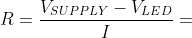

# Lab 2: Tomáš Marčák

Link to my `Digital-electronics-2` GitHub repository:

[https://github.com/tmarcak/Digital-electronics-2](https://github.com/tmarcak/Digital-electronics-2)

## Preparation tasks (done before the lab at home)

1. Draw two basic ways to connect a LED to the output pin of the microcontroller: LED active-low, LED active-high.

### Active High LED


### Active Low LED


2. [Calculate LED resistor value](https://electronicsclub.info/leds.htm) for typical red and blue LEDs.



| **LED color** | **Supply voltage** | **LED current** | **LED voltage** | **Resistor value** |
| :-: | :-: | :-: | :-: | :-: |
| red | 5 V | 20 mA | 2 v | 150 Ω |
| blue | 5 V | 20 mA | 3 V | 100 Ω |

3. Draw the basic ways to connect a push button to the microcontroller input pin: button active-low, button active-high.

### Button Active High


### Button Active Low


### Active-low and active-high LEDs

1. Complete tables according to the AVR manual.

| **DDRB** | **Description** |
| :-: | :-- |
| 0 | Input pin |
| 1 | Output pin |

| **PORTB** | **Description** |
| :-: | :-- |
| 0 | Output low value |
| 1 | Output high value |

| **DDRB** | **PORTB** | **Direction** | **Internal pull-up resistor** | **Description** |
| :-: | :-: | :-: | :-: | :-- |
| 0 | 0 | Input | No | Tri-state, high-impedance |
| 0 | 1 | Input | Yes | Pxn will source current if ext. pulled low |
| 1 | 0 | Output | No | Output Low (sink) |
| 1 | 1 | Output | No | Output High (source) |

| **Port** | **Pin** | **Input/output usage?** |
| :-: | :-: | :-- |
| A | x | Microcontroller ATmega328P does not contain port A |
| B | 0 | Yes (Arduino pin 8) |
|   | 1 | Yes (Arduino pin ~9) |
|   | 2 | Yes (Arduino pin ~10) |
|   | 3 | Yes (Arduino pin ~11) |
|   | 4 | Yes (Arduino pin 12) |
|   | 5 | Yes (Arduino pin 13) |
|   | 6 | No |
|   | 7 | No |
| C | 0 | Yes (Arduino pin A0) |
|   | 1 | Yes (Arduino pin A1) |
|   | 2 | Yes (Arduino pin A2) |
|   | 3 | Yes (Arduino pin A3) |
|   | 4 | Yes (Arduino pin A4/SDA) |
|   | 5 | Yes (Arduino pin A5/SCL) |
|   | 6 | No |
|   | 7 | No |
| D | 0 | Yes (Arduino pin RX<-0) |
|   | 1 | Yes (Arduino pin TX->1) |
|   | 2 | Yes (Arduino pin 2) |
|   | 3 | Yes (Arduino pin ~3) |
|   | 4 | Yes (Arduino pin 4) |
|   | 5 | Yes (Arduino pin ~5) |
|   | 6 | Yes (Arduino pin ~6) |
|   | 7 | Yes (Arduino pin 7) |


2. Part of the C code listing with syntax highlighting, which blinks alternately with a pair of LEDs; let one LED is connected to port B and the other to port C:

```c
int main(void)
{
    // Green LED at port B
    // Set pin as output in Data Direction Register...
    DDRB = DDRB | (1<<LED_GREEN);
    // ...and turn LED off in Data Register
    PORTB = PORTB | (1<<LED_GREEN);

    // Blue LED at port C
    DDRC = DDRC | (1<<LED_BLUE);
    PORTC = PORTC & ~(1<<LED_BLUE);

    // Infinite loop
    while (1)
    {
        // Pause several milliseconds
        _delay_ms(BLINK_DELAY);
	//Write your code here
        PORTB = PORTB ^ (1<<LED_GREEN);
        PORTC = PORTC ^ (1<<LED_BLUE);
    
    }

    // Will never reach this
    return 0;
}
```


### Push button

1. Part of the C code listing with syntax highlighting, which toggles LEDs only if push button is pressed. Otherwise, the value of the LEDs does not change. Let the push button is connected to port D:

```c
int main(void)
{
    // Green LED at port B
    // Set pin as output in Data Direction Register...
    DDRB = DDRB | (1<<LED_GREEN);
    PORTB = PORTB | (1<<LED_GREEN);

    // Blue LED at port C
    DDRC = DDRC | (1<<LED_BLUE);
    PORTC = PORTC & ~(1<<LED_BLUE);

    // Configure Push button at port D and enable internal pull-up resistor
    DDRD = DDRD & ~(1<<BUTTON);
    PORTD = PORTD | (1<<BUTTON);

    // Infinite loop
    while (1)
    {
        if(bit_is_set(PIND, 2))
        {
	    PORTB = PORTB ^ (1<<LED_GREEN);
            PORTC = PORTC ^ (1<<LED_BLUE);
	    // Pause several milliseconds
	    _delay_ms(BLINK_DELAY);
        
        }        
    }        
    

    // Will never reach this
    return 0;
}
```


### Knight Rider

1. Scheme of Knight Rider application, i.e. connection of AVR device, five LEDs, resistors, one push button, and supply voltage. The image can be drawn on a computer or by hand. Always name all components and their values!

   
