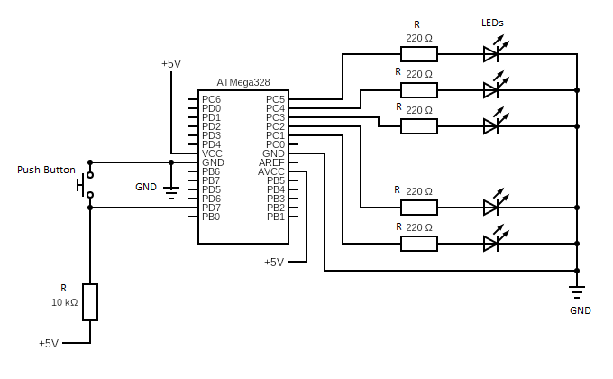

# Lab 3: Tomáš Marčák

Link to my `Digital-electronics-2` GitHub repository:

[https://github.com/tmarcak/Digital-electronics-2](https://github.com/tmarcak/Digital-electronics-2)


### Data types in C

1. Complete table.

| **Data type** | **Number of bits** | **Range** | **Description** |
| :-: | :-: | :-: | :-- | 
| `uint8_t`  | 8 | 0, 1, ..., 255 | Unsigned 8-bit integer |
| `int8_t`   | 8 | -128, ..., 0, 1, ..., 127 | Signed 8-bit integer |
| `uint16_t` | 16 | 0, ..., 65536 | Unsigned 16-bit integer |
| `int16_t`  | 16 | -32768, ..., 32767 | Signed 16-bit integer |
| `float`    | 32 | -3.4e+38, ..., 3.4e+38 | Single-precision floating-point |
| `void`     | - | - | Keyword for no parameters/outputs |


### GPIO library

1. In your words, describe the difference between the declaration and the definition of the function in C.
   * Function declaration - Specification of inputs and outputs and their types. Declaration gives details about the properties of a variable.
   * Function definition -  Definition of a variable says where the variable gets stored. For example, memory for the variable is allocated during the definition of the variable. 

2. Part of the C code listing with syntax highlighting, which toggles LEDs only if push button is pressed. Otherwise, the value of the LEDs does not change. Use function from your GPIO library. Let the push button is connected to port D:

```c
int main(void)
{
    // Green LED at port B
    GPIO_config_output(&DDRB, LED_GREEN);
    GPIO_write_low(&PORTB, LED_GREEN);

    // Configure the second LED at port C
    GPIO_config_output(&DDRC, LED_RED);
    GPIO_write_low(&PORTC, LED_RED);

    // Configure Push button at port D and enable internal pull-up resistor
    GPIO_config_input_pullup(&DDRD, BTN);
    GPIO_write_high(&PORTD, BTN);

    // Infinite loop
    while (1)
    {
	    if (GPIO_read(&DDRD,BTN) == 0)
	    {
		    _delay_ms(BLINK_DELAY);

		    GPIO_toggle(&DDRB, LED_GREEN);
		    GPIO_toggle(&DDRC, LED_RED);
	    }
    }

    // Will never reach this
    return 0;
}
```


### Traffic light

1. Scheme of traffic light application with one red/yellow/green light for cars and one red/green light for pedestrians. Connect AVR device, LEDs, resistors, one push button (for pedestrians), and supply voltage. The image can be drawn on a computer or by hand. Always name all components and their values!

   
