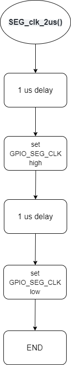
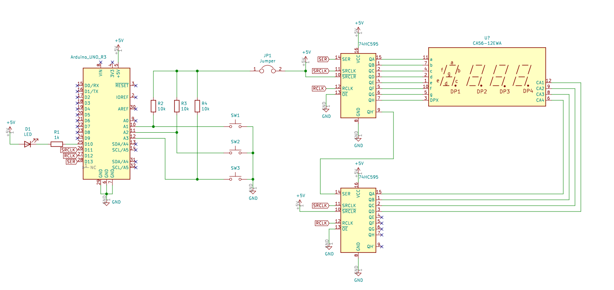

# Lab 5: Tomáš Marčák

Link to my `Digital-electronics-2` GitHub repository:

[https://github.com/tmarcak/Digital-electronics-2](https://github.com/tmarcak/Digital-electronics-2)


### 7-segment library

1. In your words, describe the difference between Common Cathode and Common Anode 7-segment display.
   * CC SSD - The common cathode has all the cathodes of the 7-segment display connected together to logic "0" or ground. The individual segments are then illuminated by applying a "High" state or logic “1”.    
   * CA SSD - The common anode has all the anodes of the 7-segment display connected together to logic "1". The individual segments are then illuminated by application of a ground, logic “0” or a "Low" state.

2. Code listing with syntax highlighting of two interrupt service routines (`TIMER0_OVF_vect`, `TIMER0_OVF_vect`) from counter application with at least two digits, ie. values from 00 to 59:

```c
/**********************************************************************
 * Function: Timer/Counter1 overflow interrupt
 * Purpose:  Increment counter value from 00 to 59.
 **********************************************************************/
uint8_t unit = 0;
uint8_t tens = 0;

ISR(TIMER1_OVF_vect)
{
	unit++;

	if(unit == 10)

	{
		tens++;
		unit = 0;

		if (tens == 6)

		{
			tens = 0;
			unit = 0;
		}
	}

}
```

```c
/**********************************************************************
 * Function: Timer/Counter0 overflow interrupt
 * Purpose:  Display tens and units of a counter at SSD.
 **********************************************************************/
ISR(TIMER0_OVF_vect)
{
	static uint8_t pos = 0;  // This line will only run the first time
	
	if(pos == 0)

	{
		SEG_update_shift_regs(unit,pos);
		pos = 1;
	}

	else

	{
		SEG_update_shift_regs(tens,pos);
		pos = 0;
	}
	
}
```

3. Flowchart figure for function `SEG_clk_2us()` which generates one clock period on `SEG_CLK` pin with a duration of 2&nbsp;us. The image can be drawn on a computer or by hand. Use clear descriptions of the individual steps of the algorithms.

   


### Kitchen alarm

Consider a kitchen alarm with a 7-segment display, one LED and three push buttons: start, +1 minute, -1 minute. Use the +1/-1 minute buttons to increment/decrement the timer value. After pressing the Start button, the countdown starts. The countdown value is shown on the display in the form of mm.ss (minutes.seconds). At the end of the countdown, the LED will start blinking.

1. Scheme of kitchen alarm; do not forget the supply voltage. The image can be drawn on a computer or by hand. Always name all components and their values.

   
